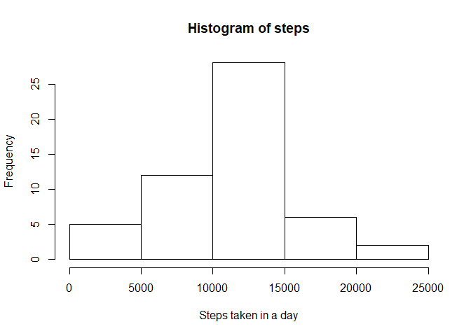
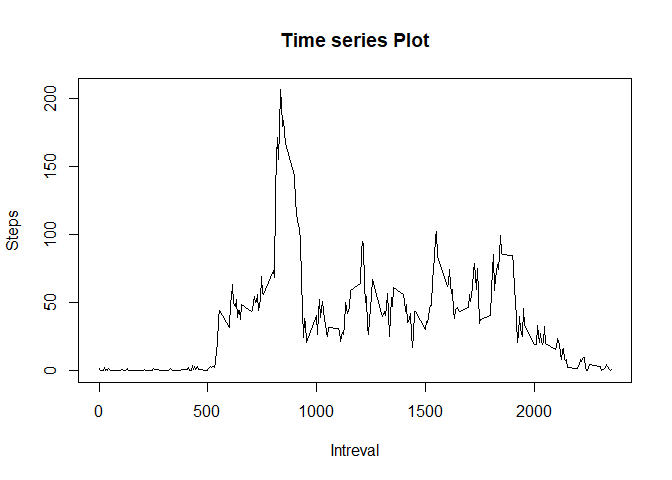
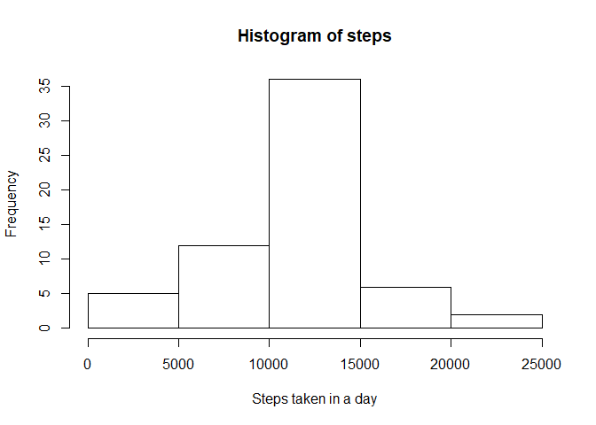
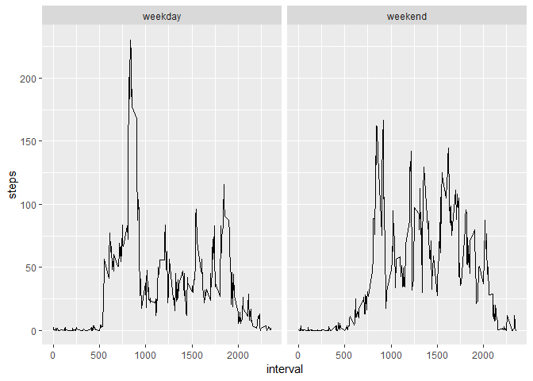

## Loading and preprocessing the data

```r
activity <- read.csv("C:/Users/Abhishek/Desktop/activity.csv")
```
Exploring the dataset

```r
head(activity)
```

```
##   steps       date interval
## 1    NA 2012-10-01        0
## 2    NA 2012-10-01        5
## 3    NA 2012-10-01       10
## 4    NA 2012-10-01       15
## 5    NA 2012-10-01       20
## 6    NA 2012-10-01       25
```

```r
summary(activity)
```

```
##      steps                date          interval     
##  Min.   :  0.00   2012-10-01:  288   Min.   :   0.0  
##  1st Qu.:  0.00   2012-10-02:  288   1st Qu.: 588.8  
##  Median :  0.00   2012-10-03:  288   Median :1177.5  
##  Mean   : 37.38   2012-10-04:  288   Mean   :1177.5  
##  3rd Qu.: 12.00   2012-10-05:  288   3rd Qu.:1766.2  
##  Max.   :806.00   2012-10-06:  288   Max.   :2355.0  
##  NA's   :2304     (Other)   :15840
```


## What is mean total number of steps taken per day?

```r
agg<-aggregate(steps~date,data=activity,na.rm=TRUE,FUN=sum)
print(agg)
```

```
##          date steps
## 1  2012-10-02   126
## 2  2012-10-03 11352
## 3  2012-10-04 12116
## 4  2012-10-05 13294
## 5  2012-10-06 15420
## 6  2012-10-07 11015
## 7  2012-10-09 12811
## 8  2012-10-10  9900
## 9  2012-10-11 10304
## 10 2012-10-12 17382
## 11 2012-10-13 12426
## 12 2012-10-14 15098
## 13 2012-10-15 10139
## 14 2012-10-16 15084
## 15 2012-10-17 13452
## 16 2012-10-18 10056
## 17 2012-10-19 11829
## 18 2012-10-20 10395
## 19 2012-10-21  8821
## 20 2012-10-22 13460
## 21 2012-10-23  8918
## 22 2012-10-24  8355
## 23 2012-10-25  2492
## 24 2012-10-26  6778
## 25 2012-10-27 10119
## 26 2012-10-28 11458
## 27 2012-10-29  5018
## 28 2012-10-30  9819
## 29 2012-10-31 15414
## 30 2012-11-02 10600
## 31 2012-11-03 10571
## 32 2012-11-05 10439
## 33 2012-11-06  8334
## 34 2012-11-07 12883
## 35 2012-11-08  3219
## 36 2012-11-11 12608
## 37 2012-11-12 10765
## 38 2012-11-13  7336
## 39 2012-11-15    41
## 40 2012-11-16  5441
## 41 2012-11-17 14339
## 42 2012-11-18 15110
## 43 2012-11-19  8841
## 44 2012-11-20  4472
## 45 2012-11-21 12787
## 46 2012-11-22 20427
## 47 2012-11-23 21194
## 48 2012-11-24 14478
## 49 2012-11-25 11834
## 50 2012-11-26 11162
## 51 2012-11-27 13646
## 52 2012-11-28 10183
## 53 2012-11-29  7047
```
Histogram of steps

```r
hist(agg$steps,xlab="Steps taken in a day",main="Histogram of steps")
```

<!-- -->
<br/>

Finding mean and median

```r
Mean<-mean(agg$steps)
Mean
```

```
## [1] 10766.19
```

```r
Median<-median(agg$steps)
Median
```

```
## [1] 10765
```

## What is the average daily activity pattern?
Time series plot

```r
agg2<-aggregate(steps~interval,data=activity,na.rm=TRUE,FUN=mean)
plot(agg2$interval,agg2$steps,type="l",xlab="Intreval",ylab="Steps",main="Time series Plot")
```

<!-- -->
<br/>

Finding interval corresponding to maximum steps

```r
Maxi<-subset(agg2,agg2$steps==(max(agg2$steps)))
Maxi$interval
```

```
## [1] 835
```
Total number of misssing values

```r
a<-subset(activity,is.na(steps))
 NROW(a)
```

```
## [1] 2304
```
## Imputing missing values
 Method to fill missing values : Replace the NA values of a particular step with the average number of steps of the corresponding interval it belongs to. Replacing missing values:

```r
ac2<-aggregate(steps~interval,data=activity,FUN=mean)
for (i in 1:nrow(activity))
{
  if(is.na(activity$steps[i]))
  {
    activity$steps[i]<-ac2$steps[which(ac2$interval %in% activity$interval[i])]
  }
}
```
Creating new dataset : Missing values already replaced in original dataset

```r
Activit<-activity
```


## Are there differences in activity patterns between weekdays and weekends?
Making histogram

```r
agg2<-aggregate(steps~date,data=Activit,na.rm=TRUE,FUN=sum)
hist(agg2$steps,xlab="Steps taken in a day",main="Histogram of steps")
```

<!-- -->
Calculating mean and median

```r
Mean<-mean(agg2$steps)
Mean
```

```
## [1] 10766.19
```

```r
Median<-median(agg2$steps)
Median
```

```
## [1] 10766.19
```
 As we can see, there is a difference between the two histograms belonging to the two datasets. The frequency has increased when the missing values have been replaced. This was expected.
There is a slight change in the mean and median as well 

Making panel plot containing plots of average number of steps taken
on weekdays and weekends.

```r
library(ggplot2)
activity$date<-as.POSIXlt(activity$date)
activity$day <-  ifelse(weekdays(activity$date) %in% c("Saturday","Sunday"), 'weekend', 'weekday')
table(activity$day)
```

```
## 
## weekday weekend 
##   12960    4608
```

```r
agg3<-aggregate(steps~interval+day,data=activity,na.rm=TRUE,FUN=mean)
ggplot(agg3,aes(x=interval,y=steps),color=day)+geom_line()+facet_wrap(~day)
```

<!-- -->
